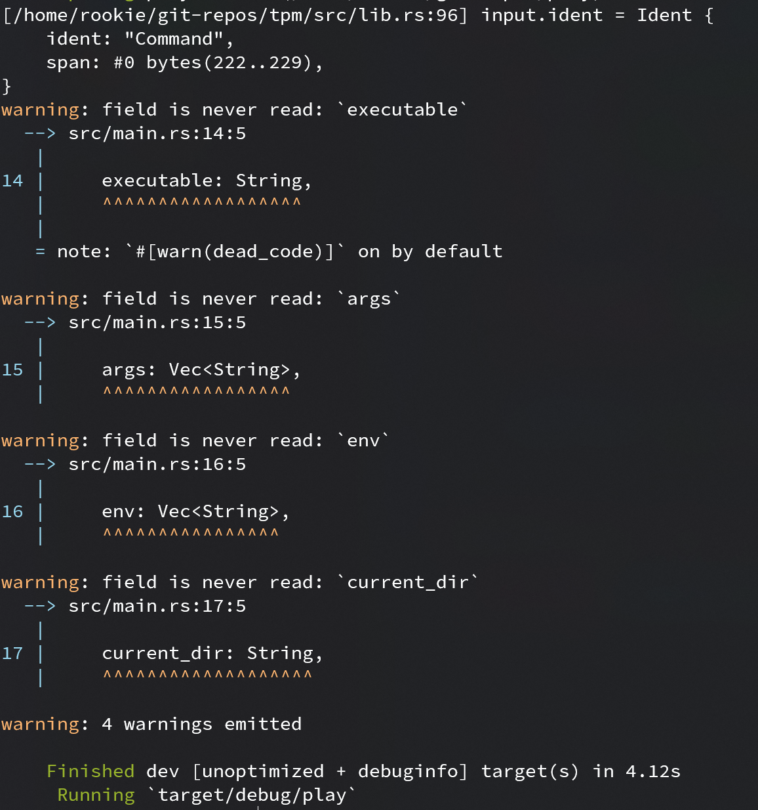
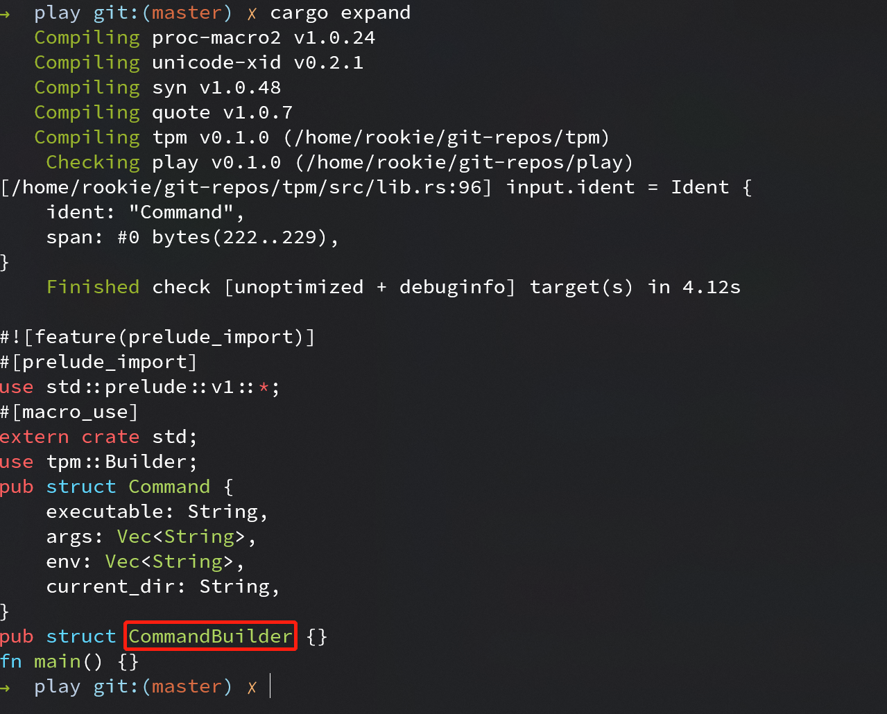

# Builder - 实现

## 目标

对于如下一个结构体，使用 `Builder` 宏可以方便地使用 builder 模式构建结构体“实例”

```rust
use derive_builder::Builder;

#[derive(Builder)]
pub struct Command {
    executable: String,
    args: Vec<String>,
    env: Vec<String>,
    current_dir: String,
}

fn main() {
    // 通过 builder 方法获取一个 builder
    let mut builder = Command::builder();
    // builder 自动实现与原结构体字段同名的构建函数
    builder.executable("cargo".to_owned());
    builder.args(vec!["build".to_owned(), "--release".to_owned()]);
    builder.env(vec![]);
    builder.current_dir("..".to_owned());
    // 最后调用 build 方法获取构建好的结构体
    let command = builder.build().unwrap();
}
```

## 实现

### 思路

不考虑使用宏的情况下，可以创建一个 `CommandBuilder` 结构体，其实现了 `executable`, `args` 和 `env` 等方法。

```rust
pub struct CommandBuilder {
    executable: Option<String>,
    args: Option<Vec<String>>,
    env: Option<Vec<String>>,
    current_dir: Option<String>,
}

impl CommandBuilder {
    pub fn executable(&mut self, executable: String) -> &mut Self {
        self.executable = Some(executable);
        self
    }

    pub fn args(&mut self, args: Vec<String>) -> &mut Self {
        self.args = Some(args);
        self
    }

    pub fn env(&mut self, env: Vec<String>) -> &mut Self {
        self.env = Some(env);
        self
    }

    pub fn current_dir(&mut self, current_dir: String) -> &mut Self {
        self.current_dir = Some(current_dir);
        self
    }

    pub fn build(&self) -> std::result::Result<Command, &str> {
        Ok(Command {
            executable: self.executable.clone().ok_or("executable is not set")?,
            args: self.args.clone().ok_or("args is not set")?,
            env: self.env.clone().ok_or("env is not set")?,
            current_dir: self.current_dir.clone().ok_or("current_dir is not set")?,
        })
    }
}
```

观察上面实现，我们需要先定义 `xxxBuilder` 的结构体，这个结构体所有字段名和 `xxx` 中的一样，但字段类型包了一层
`Option`。
接着相当于遍历 `xxx` 中的每个字段，为 `xxxBuilder` 实现同名方法，接着在 `build` 方法构建出需要的结构体。

`macro_rules!` 无法为我们实现上面功能，因此需要请出 Rust 中的过程宏(Procedural Macro)。

### 过程宏简介

**ref:** [Rust Book - Procedural Macro](https://doc.rust-lang.org/reference/procedural-macros.html)

过程宏同样是对代码进行展开，但它能在编译器对 AST 进行操作，因此可实现更多功能。

过程宏分为三种形式

1. 类函数式过程宏(function-like macros)，类似 `macro_rules!` 创建的宏，如 `custom!`
2. 推导宏(derive macros)，如 `#[derive(CustomDeriv)]`
3. 属性宏(derive macros)，如 `#[CustomAttributes]`

创建过程宏 crate 需要如下几步。

```bash
cargo new --lib <create_name>
```

接着编辑 crate `Cargo.toml` 文件, 添加如下设置

```toml
[lib]
proc-macro = true
```

如果某个过程宏只是自用，不共享给其他 crate 使用，那是不是可以把他们放入同一个 crate 呢？
答案是*“不行”*。为什么呢？

在 Rust Book 中这样描述 crate

> A crate is a unit of compilation and linking, as well as versioning, distribution, and runtime loading. 

“crate 是 Rust 中的最小编译单位”, 而过程宏是作用是在编译阶段操作 AST，如果要求一个 crate 能在编译自己时对自身 AST 进行映射，
显然是在为难编译器。

在进行上面的配置后，编译其会自动提供 [proc_macro](https://doc.rust-lang.org/proc_macro/index.html) 依赖，
这个依赖提供了操作 Rust token 流所需的方法和类型，但操作 AST 是一项繁琐无聊的工作，好在社区大佬 [dtolany](https://github.com/dtolnay)
提供了 [syn](https://github.com/dtolnay/syn) 和 [quote](https://github.com/dtolnay/quote)两个库方便我们操作 AST。

```toml
[lib]
proc-macro = true

[dependencies]
syn = { version = "1.0.48", features = ["extra-traits"] }
quote = "1.0.7"
```

syn 提供了 `proc_macro::TokenStream` 到更高级数据结构如 `syn::DeriveInput` 解析，而 quote 则可以让我们像写模板一样填充
一些数据，就可以生产符合 Rust 语法规则的 TokenStream。

为了方便开发，syn 应该带上 "extra-traits" 特征，方便通过 Debug trait 开发，在正式发布时为了加快编译速度再去掉。

如果对 syn 不熟悉建议花点时间看看 syn 的 [README.md](https://github.com/dtolnay/syn) 和文档，特别是[DeriveInput](https://docs.rs/syn/1.0.48/syn/struct.DeriveInput.html)
文档。

最后一个非常有用的工具是 `cargo-expand`, 它可以展示展开后的过程宏，先安装 nightly Rust, 而后 `cargo install cargo-expand` 即可安装。


### 获取被修饰结构体名称

按照 syn README 上的示例和文档可以很方便地获取被修饰结构体名称

```rust
use proc_macro::TokenStream;
use quote::quote;
use syn::{parse_macro_input, DeriveInput};

#[proc_macro_derive(Builder)]
pub fn derive(input: TokenStream) -> TokenStream {
    // 把 TokenStream 解析为语法树
    let input = parse_macro_input!(input as DeriveInput);
    // indent 即为被修饰结构体名称相关数据结构
    let name = dbg!(input.ident);
    let bname = format!("{}Builder", name);
    // 构建一个新的 indent
    let bident = syn::Ident::new(&bname, name.span());

    // 最后填充扩展 AST
    let expanded = quote! {
        pub struct #bident {}
    };

    //把展开后的 AST 返回给编译器
    TokenStream::from(expanded)
}
```

由于我们尚未实现所需方法, 为了编译通过先把使用 builder 的 main 函数置空

```rust
fn main() {}
```

在编译使用 Builder 宏的 crate 时应该能看到 `dbg!` 打印出的信息



如果使用 cargo expand 应该能看到我们已经创建了 `CommandBuilder` 结构体



### 遍历字段

根据 DerivInput 文档, 我们可以在 .data 里获取结构体字段, 虽然 .data 有多个 enum 进行嵌套, 但这里为了方便只考虑最简单的情形, 其他情况一律抛 panic, 直到拿到 [syn::Field](https://docs.rs/syn/1.0.48/syn/struct.Field.html).

对于每个 field, 可以通过 ident 和 ty 字段分别获取字段名和字段类型. executable 字段对应的 syntax tree 如下


